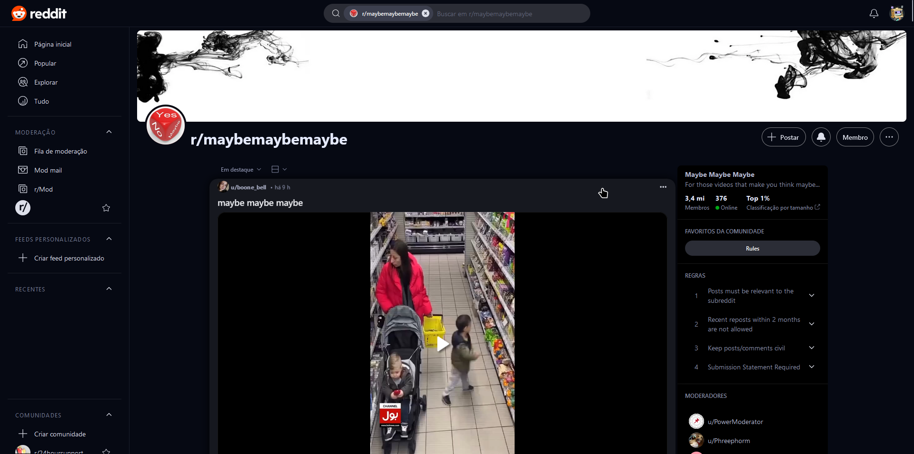
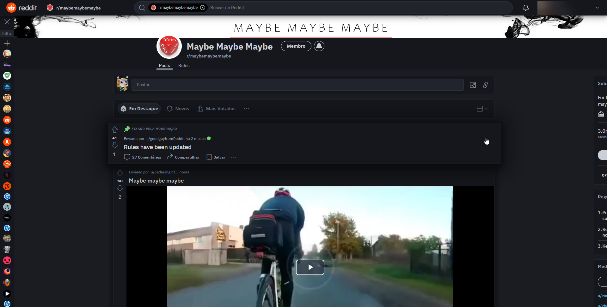

# Minimal Reddit

 

 ## Userstyle for reddit, clean interface.

- Wide posts.
- Set the width of the posts.
- Change base color of interface.
- Removal of some elements.
- Remove/minimize the sidebar/navbar/subbar.

### OBS: In the Shreddit/3rd generation of the interface, there are many isolated elements with shadowRoot, some options will require installing a userscript: [Style shadowDOM](https://greasyfork.org/scripts/459799-style-shadowdom)
 
## Preview

### Shreddit - [Install](https://github.com/zenstorage/Minimal-Reddit/raw/main/minimal_reddit_3rd.user.styl)

### Newreddit - [Install](https://github.com/zenstorage/Minimal-Reddit/raw/main/minimal_reddit.user.styl)

